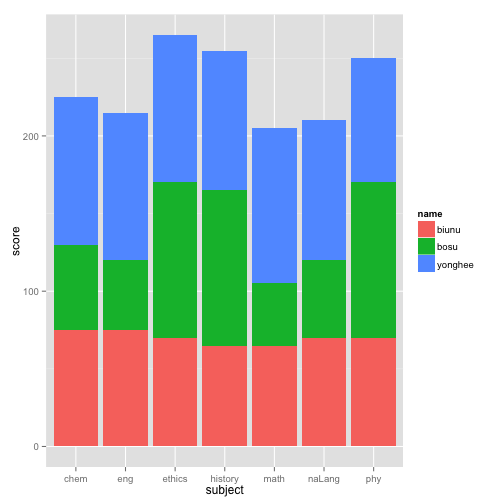

* ????????? ??????

```r
score<- read.csv("./record.csv",header=T)
```

### 5 word summary??? ???????????????...

```r
library(pastecs)
```

```
## Loading required package: boot
```

```r
stat.desc(score[,2:4])
```

```
##                  biunu     bosu   yonghee
## nbr.val        7.00000   7.0000   7.00000
## nbr.null       0.00000   0.0000   0.00000
## nbr.na         0.00000   0.0000   0.00000
## min           65.00000  40.0000  80.00000
## max           75.00000 100.0000 100.00000
## range         10.00000  60.0000  20.00000
## sum          490.00000 490.0000 645.00000
## median        70.00000  55.0000  95.00000
## mean          70.00000  70.0000  92.14286
## SE.mean        1.54303  10.7460   2.40464
## CI.mean.0.95   3.77567  26.2945   5.88395
## var           16.66667 808.3333  40.47619
## std.dev        4.08248  28.4312   6.36209
## coef.var       0.05832   0.4062   0.06905
```


### 차트를 그리기 위해 

```r
library("reshape2")
score.melted <- melt(score,id.vars=c("subject"))
colnames(score.melted) <- c("subject","name","score")
str(score.melted)
```

```
## 'data.frame':	21 obs. of  3 variables:
##  $ subject: Factor w/ 7 levels "chem","eng","ethics",..: 6 2 5 1 7 4 3 6 2 5 ...
##  $ name   : Factor w/ 3 levels "biunu","bosu",..: 1 1 1 1 1 1 1 2 2 2 ...
##  $ score  : int  70 75 65 75 70 65 70 50 45 40 ...
```


```r
library(ggplot2)

#stacked bar chart를 그립니다.
ggplot(data = score.melted, aes(x = subject, y = score, fill = name)) + 
       geom_bar(stat = "identity") + xlab("subject") 
```

 

```r
boxplot(score ~ name, data=score.melted, main="Score Analysis")
```

 


